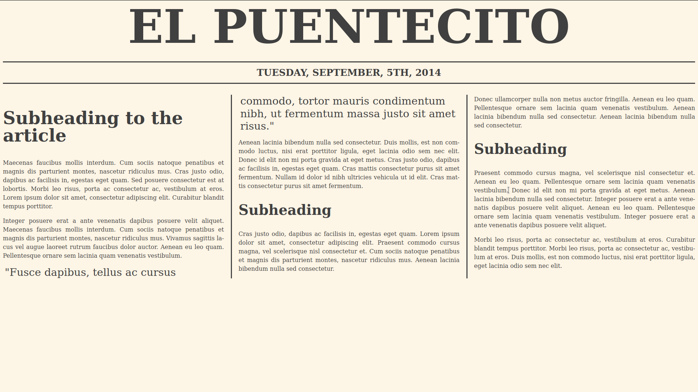

# ¡Apuntes! #



## HTML ##

### Elementos títulos o encabezados ###

Los elementos de encabezado implementan seis niveles de encabezado del documento, `<h1>` es el más importante, y `<h6>`, el menos importante.

```html
<h1>texto</h1>
<h2>texto</h2>
<h3>texto</h3>
<h4>texto</h4>
<h5>texto</h5>
<h6>texto</h6>
```

### Párrafo ###

El elemento párrafo es el apropiado para distribuir el texto en párrafos.

```html
<p>texto</p>
```

### Cita ###

Crea citas en bloque, marca las citas a otros autores o documentos.

```html
<blockquote>texto</blockquote>
```

### Artículo ###

El Elemento article de HTML `<article>` representa una composición auto-contenida en un documento

```html
<article>texto</article>
```

## CSS ##

```CSS
selector {
    propiedad: valor;
}
```

### Texto ###

-------------------------------------------------------------------------------

#### font-family ####

La propiedad font-family define una lista de fuentes o familias de fuentes, con un orden de prioridad, para utilizar en un elemento seleccionado.

```CSS
selector {
    font-family: serif;
}
```

Valores que usaremos: `serif` y `sans-serif`

[MDN](https://developer.mozilla.org/es/docs/Web/CSS/font-family)

-------------------------------------------------------------------------------

#### font-size ####

La propiedad font-size especifica la dimensión de la letra.

```CSS
selector {
    font-size: 1.6em;
}
```

Valores que usaremos: `1em` - `8em`

[MDN](https://developer.mozilla.org/es/docs/Web/CSS/font-size)

-------------------------------------------------------------------------------

#### font-weight ####

La propiedad font-weight de CSS especifica el peso o grueso de la letra.

```CSS
selector {
    font-weight: bold;
}
```

Valores que usaremos: `bold`

[MDN](https://developer.mozilla.org/es/docs/Web/CSS/font-weight)

-------------------------------------------------------------------------------

#### line-height ####

Comúnmente se usa para establecer la distancia entre líneas de texto.

```CSS
selector {
    line-height: 1.2em;
}
```

Valores que usaremos: `0.8em` - `1.5em`

[MDN](https://developer.mozilla.org/es/docs/Web/CSS/line-height)

-------------------------------------------------------------------------------

#### text-align ####

Establece el alineamiento horizontal de un texto.

```CSS
selector {
    text-align: center;
}
```

Valores que usaremos: `center` - `justify`

[MDN](https://developer.mozilla.org/es/docs/Web/CSS/text-align)

-------------------------------------------------------------------------------

#### text-transform ####

La propiedad CSS text-transform especifica el cambio entre mayúsculas y minúsculas del texto de un elemento

```CSS
selector {
    text-transform: uppercase;
}
```

Valores que usaremos: `uppercase`

[MDN](https://developer.mozilla.org/es/docs/Web/CSS/text-transform)

-------------------------------------------------------------------------------

#### hypens ####

La propiedad CSS hyphens especifica cómo deben dividirse las palabras cuando el texto se ajusta a través de múltiples líneas.

```CSS
selector {
    hyphens: auto;
}
```

Valores que usaremos: `auto`

[MDN](https://developer.mozilla.org/es/docs/Web/CSS/hyphens)

-------------------------------------------------------------------------------

### Colores ###

#### background-color ####

Background-color es un propiedad de CSS que define el color de fondo de un elemento

```CSS
selector {
    background-color: OldLace;
}
```

Valores que usaremos: `OldLace`

[MDN](https://developer.mozilla.org/es/docs/Web/CSS/background-color)

-------------------------------------------------------------------------------

#### color ####

La propiedad de CSS color selecciona el valor de color de primer plano del contenido de elemento de texto y decoraciones de texto

```CSS
selector {
    color: #404040;
}
```

Valores que usaremos:  `#404040`

[MDN](https://developer.mozilla.org/es/docs/Web/CSS/color)

-------------------------------------------------------------------------------

### Distribución ###

#### columns

Establece el número de columnas de un elemento

```CSS
selector {
    columns: 3;
}
```

valores que usaremos: `3`

[MDN](https://developer.mozilla.org/es/docs/Web/CSS/columns)

---

#### column-gap

Establece el espaciado entre los elementos de las distintas columnas

```CSS
selector {
    column-gap: 40px;
}
```

valores que usaremos: `40px`

[MDN](https://developer.mozilla.org/es/docs/Web/CSS/column-gap)

---

#### column-rule

Pinta una línea para separar las columnas

```CSS
selector {
    column-rule: medium solid #404040;
}
```

valores que usaremos: `medium solid #444`

[MDN](https://developer.mozilla.org/es/docs/Web/CSS/column-rule)

---

#### padding

La propiedad CSS `padding` establece el espacio de relleno por todos los lados de un elemento.

Método abreviado:
```CSS
selector {
    padding: 12px;
}
```

Método abreviado, múltiples valores:
```CSS
selector {
    padding: 0 5px 10px 15px;
}
```

Descomposición de método abreviado en múltiples valores:
```CSS
selector {
    padding-top: 0;
    padding-right: 5px;
    padding-bottom: 10px;
    padding-left: 15px;
}
```

valores que usaremos: `0` - `12px`

[MDN](https://developer.mozilla.org/es/docs/Web/CSS/padding)

---

#### margin

La propiedad CSS `margin` establece el espacio exterior por todos los lados de un elemento.

Método abreviado:
```CSS
selector {
    margin: 12px;
}
```

Método abreviado, múltiples valores:
```CSS
selector {
    margin: 0 5px 10px 15px;
}
```

Descomposición de método abreviado en múltiples valores:
```CSS
selector {
    margin-top: 0;
    margin-right: 5px;
    margin-bottom: 10px;
    margin-left: 15px;
}
```

valores que usaremos: `0` - `30px`

[MDN](https://developer.mozilla.org/es/docs/Web/CSS/margin)

---

#### border

La propiedad CSS `border` establece un borde para el elemento de bloque

Método abreviado:
```CSS
selector {
    border: medium solid #404040;
}
```

Descomposición de método abreviado en múltiples valores:
```CSS
selector {
    border-width: medium;
    border-style: solid;
    border-color: #404040;
}
```

Método abreviado, sólo 1 borde:
```CSS
selector {
    border-top: medium solid #404040;
}
```

valores que usaremos: `medium solid #444`

[MDN](https://developer.mozilla.org/es/docs/Web/CSS/border)

---

### Anexo enlaces interesantes ###
[color names](https://www.w3schools.com/colors/colors_names.asp)
[codePen](https://codepen.io)
